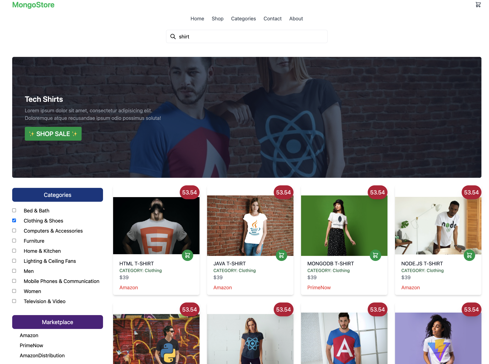
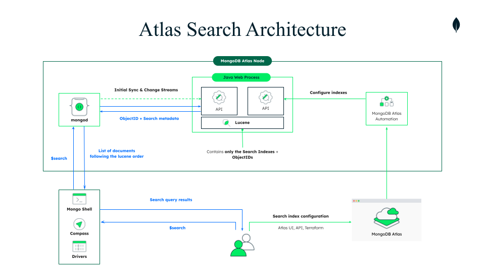

## E-Commerce Sample Application

<h2> Atlas Search Hackathon</h2>

<h3>Sponsored by Amazon Web Services</h3>

Hello! 👋 This e-commerce application allows you to search lightning fast through a wide variety of data types through a dataset of Amazon products.

 

 

 Atlas Search Store implements many Atlas Search features from autocomplete to custom function scoring. Using the $search operator in a MongoDB aggregation pipeline, we can build fine-grained searches across text, numerics, and geospatial data. By building out this application, you'll learn all sorts of ways MongoDB allows you to build complex, fine-grained full-text searches on your Atlas data.

**No additional servers or software needed. No need to keep data in sync. Everything is done in MongoDB Atlas.**

Current features implemented in this e-commerce application include:

- fuzzy matching
- highlighting
- autocomplete
- relevance-based scoring
- custom function scoring

Future Atlas Search features to implement can include:

- [ ] range queries
- [ ] facets
- [ ] synonyms

<h2 align="center"><a href="https://searchstore-zhtzd.mongodbstitch.com/">https://searchstore-zhtzd.mongodbstitch.com</a></h2>

This application was created using:

- React
- Tailwind CSS
- MongoDB Realm for backend HTTPs endpoints and webhooks
- A sample dataset of Amazon products

<h3>API Points of Integration</h3>
This application is hosted entirely on Realm and calls 2 API endpoints:
 
 * getProducts in the Home.js page
 * Suggestions_AC_Endpoint, used for autocompleted product names, in the Header.js component.

<em>Currently this app is not suitable for mobile, but feel free to send a PR.</em> 😊

<h3>Prerequisites</h3>

- A MongoDB Atlas account. Get one for free <a href="https://www.mongodb.com/cloud/atlas">here.</a>
- A recent version of Node.js and npm.
- Amazon product sample dataset
- (Recommended) <a href="https://www.mongodb.com/try/download/compass">MongoDB Compass - GUI</a>

<h3>Instructions</h3>

In the project directory, you can run:

#### `npm install`

#### `npm start`

Runs the app in the development mode.\
Open [http://localhost:3000](http://localhost:3000) to view it in your browser.

### Atlas Search Hackathon Template:

https://github.com/jamesmilesmdb/atlas-search-hackathon-22

 

 

If you have any questions or feedback about this repo, feel free to create an Issue or PR in this repo or reach out to me on Twitter @YouOldMaid.

Also please join our online <a href="https://developer.mongodb.com/community/forums/">MongoDB Community</a> to interact with our product and engineering teams along with thousands of other MongoDB and Realm users.   Have fun and happy coding!
